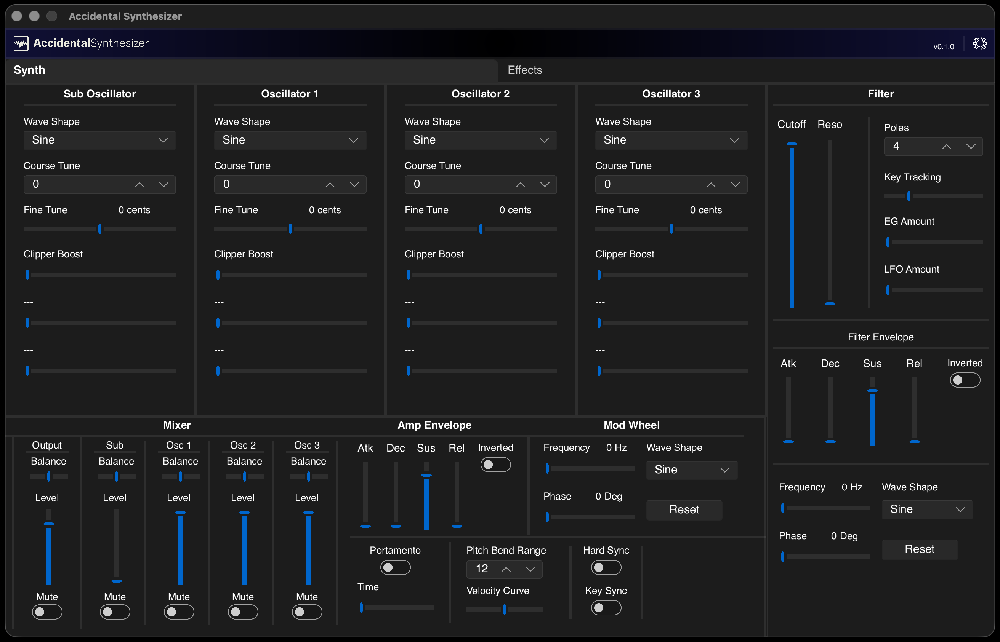

# Accidental Synthesizer (AccSyn)

Standalone, native UI, four‑oscillator mono synthesizer written in Rust.

[](https://gitlab.com/joltedbot-public/accidental-synth/-/pipelines)
[](LICENSE)
[](https://gitlab.com/joltedbot-public/accidental-synth/-/tags)

---

## Overview
Accidental Synthesizer (AccSyn) is a standalone four‑oscillator mono synth with a native UI.

I am, perhaps foolishly, writing it in Rust, largely for my own education and amusement.


## Project Status
In early development. I am actively working towards and MVP that includes the basic functional synth voice and a working UI for the current state 
of the synth.

The synth voice works and is controllable via MIDI though control over the devices and channels is lacking without the UI. 

The UI loads with the application but is not connected the backend yet which is what is currently being worked on.


## Features
Current:
- Minimal end‑to‑end audio path on macOS using CoreAudio.
- MIDI input handling (omni mode for now): Note On/Off, Velocity, Pitch Bend, and Control Change (per implementation chart in the Wiki).
- The initial UI loads and the settings panel allows for device selection but the synth controls are not yet connected to the backend.

Planned for MVP:
- A functional native UI.


## Quick Start

### Prerequisites
- Rust (stable, edition 2024). No specific toolchain version required.
- macOS (Apple Silicon) — It is written and tested on macOS Tahoe but will likely work on previous versions. It will likely work on intel macs as 
  well but has not been tested.
- No external system dependencies beyond those pulled via Cargo. 
- On macOS, the app is not code‑signed; you may need to allow running apps from unidentified developers in System Settings.

### Build
```bash
cargo build --release
```


### Run
Default (The UI will load, but it is not fully connected yet):
```bash
./accidental-synth
```


## Usage
1. Connect your MIDI input device and ensure your audio output device is available.  Midi is hot swappable. Audio is not yet.
2. Run accidental-synth. By default, it will choose the first MIDI input and first audio output device it discovers. You can change them in the 
   settings pane.l (Gear icon, top right)
4. Play from a MIDI keyboard, sequencer, or arpeggiator

### MIDI
- AccSyn also presents itself as a MIDI input device in CoreMIDI so you can use it directly from a DAW or other tools.
- It is basically fully controllable with midi CC
- It defaults to omni channel mode but you can change that in the setings pannel
- Supported messages: Note On/Off, Velocity, Pitch Bend, Control Change (see the [MIDI Implementation Chart](https://gitlab.com/joltedbot-public/accidental-synth/-/wikis/home)).

### Audio
- By default, the first CoreAudio output device is selected at startup. You can select other devices in the settings panel.
- Mono devices will use the left channel only and for devices with 2 or more channels you get independently selctable stereo channels.
- Do to some current crate limitations, audio isn't hot swappable. Once the app is running you will need to restart it to rescan devices. This is 
  next on the list to fix.

### CLI Commands
```
Usage: accidental-synth [OPTIONS]

Options:
      --headless
  -h, --help      Print help
  -V, --version   Print version
```

## MVP UI


Screenshot (initial MVP UI):




## License
Licensed under the Apache License, Version 2.0. See the [LICENSE](LICENSE) file for details.

## Links
- Repository: https://gitlab.com/joltedbot-public/accidental-synth
- Issues: https://gitlab.com/joltedbot-public/accidental-synth/-/issues
- Wiki & MIDI Implementation Chart: https://gitlab.com/joltedbot-public/accidental-synth/-/wikis/home
