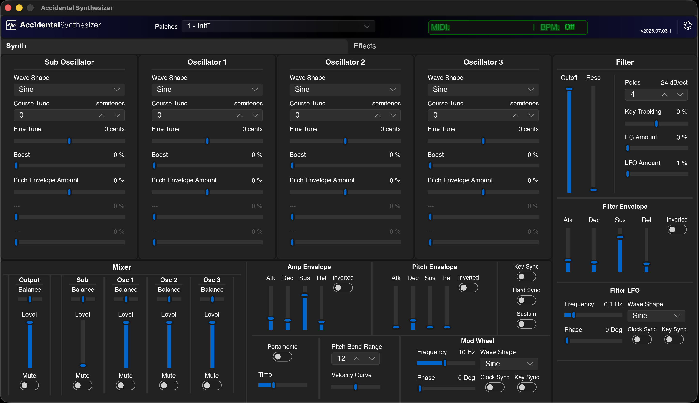
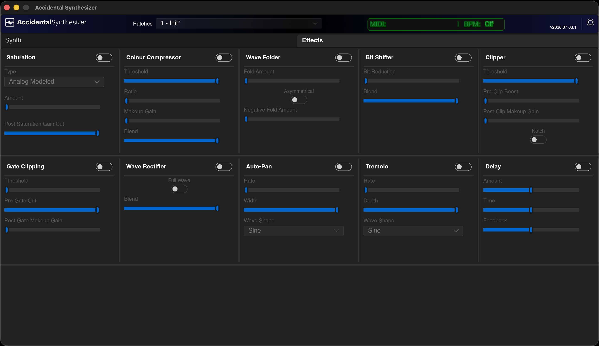

# Accidental Synthesizer (AccSyn)

Standalone, native UI, four‑oscillator mono synthesizer written in Rust.

[](https://gitlab.com/joltedbot-public/accidental-synth/-/pipelines)
[](LICENSE)
[](https://gitlab.com/joltedbot-public/accidental-synth/-/tags)

---

## Overview
Accidental Synthesizer (AccSyn) is a standalone four‑oscillator mono synth for macOS, built in Rust with a Slint UI. 

AccSyn is a native macOS app not a plugin. It is designed more to fit into a dawless jam than a recording session. 
It is not an emulation of a hardware synth or trying to give you every feature. Hopefully, though, it leads you to make some sounds you wouldn't 
normally make.


## Project Status
Accidental Synthesizer is a working, playable synthesizer. The synth voice, MIDI integration, audio output, and UI are all fully connected and 
functional. It is however in active development and so things will change over time. 

__NOTE:__ The macOS release binaries are unsigned. I can't justify paying Apple just to be able to give my software away for free.

If you want to run it you can either use the normal `Privacy & Security` settings in the UI or run the usual `xattr` cli commands. But make 
sure you know what you're doing first and why you have to do this little dance.


## Features
Current:
- Four-oscillator mono synth voice with multiple waveforms (sine, saw, square, triangle, pulse, supersaw, FM, AM, Broken, noise)
- Resonant lowpass filter with key tracking, envelope, and LFO modulation
- Three ADSR envelopes (amplitude, pitch, and filter) and two LFOs for modulation (pitch via the mod wheel and filter)
- Audio effects: saturation, compressor, wave folder, clipper, gate, rectifier, bit shifter, delay, auto pan, and tremolo 
- Preset & user patch system: save, load, and delete user patches; factory patches loaded in the app
- MIDI input: Note On/Off, Velocity, Pitch Bend, Control Change, Channel Pressure, Sustain Pedal, Program Change (see implementation chart in the 
  Wiki)
- Virtual MIDI input device for DAW integration; omni mode or per-channel filtering
- Hot-swappable MIDI and audio devices
- Native macOS UI

## Quick Start

### Prerequisites
- Rust (stable, edition 2024). No specific toolchain version required.
- macOS (Apple Silicon) -- It might work on Intel macOS but I can't test that myself.
- No external system dependencies beyond those pulled via Cargo. 
- On macOS, the app is not code‑signed; you may need to allow running apps from unidentified developers in System Settings.

### Build
```bash
cargo build --release
```


### Run
```bash
./accidental-synth
```


## Usage
1. Connect your MIDI input device and ensure your audio output device is available. Both MIDI and audio devices are hot-swappable.
2. Run accidental-synth. By default, it will choose the first MIDI input and first audio output device it discovers. You can change them in the
   settings panel (gear icon, top right).
3. Play from a MIDI keyboard, sequencer, or arpeggiator.

### MIDI
- AccSyn also presents itself as a MIDI input device in CoreMIDI so you can use it directly from a DAW or other tools.
- It is basically fully controllable with midi CC
- It defaults to omni-channel mode but you can change that in the settings panel
- Supported messages: Note On/Off, Velocity, Pitch Bend, Control Change (see the [MIDI Implementation Chart](https://gitlab.com/joltedbot-public/accidental-synth/-/wikis/home)).

### Audio
- By default, the first CoreAudio output device is selected at startup. You can select other devices in the settings panel.
- Mono devices will use the left channel only and for devices with 2 or more channels you get independently selectable stereo channels.
- Audio devices are hot-swappable - the app will automatically detect when devices are connected or disconnected.

### CLI Commands
```
Usage: accidental-synth [OPTIONS]

Options:
  -h, --help      Print help
  -V, --version   Print version
```

## UI


Screenshot:




## License
Licensed under the Apache License, Version 2.0. See the [LICENSE](LICENSE) file for details.

## Links
- Repository: https://gitlab.com/joltedbot-public/accidental-synth
- Issues: https://gitlab.com/joltedbot-public/accidental-synth/-/issues
- Wiki & MIDI Implementation Chart: https://gitlab.com/joltedbot-public/accidental-synth/-/wikis/home
